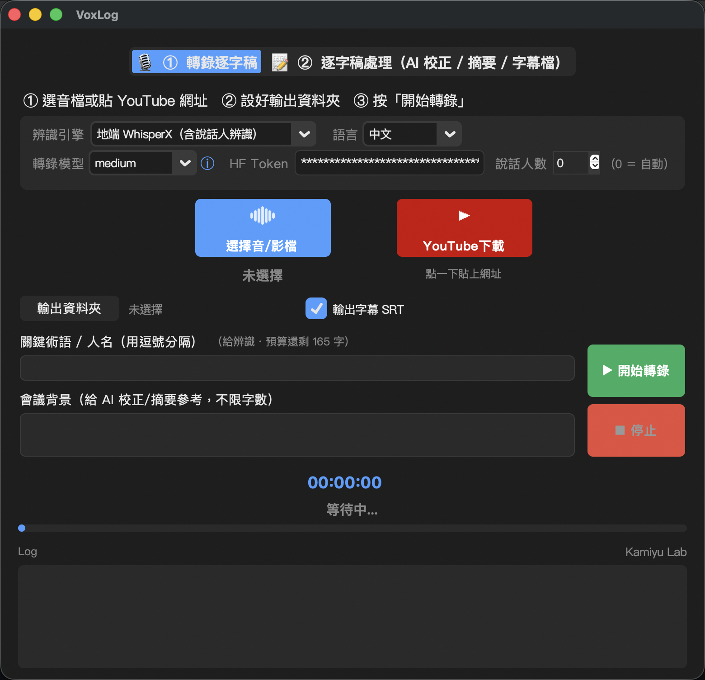

# VoxLog 🎙️

> 一鍵把語音／影片變成逐字稿與 AI 會議摘要的桌面工具（macOS / Windows）。


VoxLog 是一個具備圖形化介面 (GUI) 的語音轉文字與 AI 輔助處理工具，能自動轉錄逐字稿、校正辨識錯誤、切割 SRT 字幕，以及利用 AI 自動產生會議紀錄與待辦事項。

## ✨ 功能亮點

- 🎙️ **語音／影片轉逐字稿** — 採用 OpenAI Whisper / WhisperX，可選模型大小（速度 vs. 準確度）
- 🗣️ **說話人辨識（diarization）** — WhisperX + pyannote，標記「誰說了什麼」
- 📺 **YouTube 直接下載轉錄** — 貼網址即可，支援帶 Cookies
- 🤖 **AI 後製** — 校正辨識錯誤、產生結構化會議摘要（輸出 **Word .docx**）、切 SRT 字幕
- 🧩 **多家 AI 引擎** — Claude / Gemini / ChatGPT，以及本機的 Ollama / LM Studio
- 🖥️ **分頁式圖形介面** — 「① 轉錄 → ② 逐字稿處理」流程清楚，完成後自動開檔
- ⌨️ **一鍵啟動** — Mac 打 `voxlog`、Windows 雙擊 `VoxLog.bat`

## 📸 介面截圖

> _截圖待補：將主介面截圖存成 `docs/screenshot.png`，下面這行取消註解即可顯示。_

<!--  -->

## 🚀 快速開始

### 先選版本（依你的電腦）

| 版本 | 適合 | 功能 | 大小 |
|------|------|------|------|
| 🪶 **輕量版** | MacBook Air、記憶體 8GB 的機器 | 逐字稿 ＋ AI 摘要（用 whisper.cpp） | 小，安裝快 |
| 🧰 **完整版** | 要**分辨「誰說了哪句」**（說話人辨識）的人 | 輕量版全部 ＋ 說話人辨識 | 大幾 GB |

> 只是想把錄音變成文字、做會議摘要 → **輕量版就夠**。之後想升級成完整版，隨時可以（雙擊 `install-full.command` 即可，不用重來）。

### 🍎 macOS：雙擊安裝（推薦，不用開終端機）

1. 取得專案資料夾（用 `git clone`，或請對方把整包壓縮檔給你、解壓縮）
2. **雙擊** `install-lite.command`（完整版就雙擊 `install-full.command`）→ 等它自動裝完
3. 之後**雙擊 `voxlog`** 啟動；要更新就**雙擊 `update.command`**

> 💡 全程不用打任何指令。第一次可能會跳 Apple 的「安裝命令列工具」小視窗，按一下 Install 即可。
> 若雙擊時被 macOS 擋（「無法打開，來自未識別的開發者」），改成**對檔案按右鍵 →「打開」**一次即可。

### 🪟 Windows：一鍵啟動

用瀏覽器開 [`WINDOWS_SETUP.html`](WINDOWS_SETUP.html) 照圖文步驟裝，之後雙擊 `VoxLog.bat` 啟動。

> 想了解每個版本改了什麼，看 [CHANGELOG.md](CHANGELOG.md)。下面是**手動安裝**的完整步驟（雙擊安裝失敗、或想自己一步步來時用）。

## 系統需求
- **FFmpeg**（用於處理音訊與影片格式轉換）
- **Python**：
  - 🪟 Windows：Python 3.11 或 3.12（官網安裝時記得勾「Add to PATH」）
  - 🍎 macOS：**請用 Homebrew 的 `python@3.11`**，不要用系統內建的 Python（會讓 GUI 一開就崩潰，詳見下方 macOS 疑難排解 ①）

> 📱 **想要圖文版、手機可讀的安裝指南**：用瀏覽器開
> [`MACOS_SETUP.html`](MACOS_SETUP.html)（Mac）或 [`WINDOWS_SETUP.html`](WINDOWS_SETUP.html)（Windows），
> 每段指令都有複製鈕，照著做即可。下面是純文字版步驟。

## 手動安裝與設定說明（進階）

> 一般使用者請用上面的**雙擊安裝**即可，不需要這一段。以下是想自己一步步來、
> 或雙擊安裝失敗時的手動步驟。

### 🍎 macOS（手動）

> ⚠️ **Mac 使用者請務必先讀本節最後的「macOS 注意事項 / 疑難排解」。**
> macOS 在這個 AI 語音專案上有幾個必踩的坑（系統內建 Python 會讓 GUI 崩潰、
> 部分套件與最新版 macOS / FFmpeg 不相容），照下面步驟可一次避開。
> （這些坑，上面的 `install-lite.command` / `install-full.command` 都會自動幫你處理掉。）

1. **下載專案**
   ```bash
   git clone https://github.com/Kamiyu94/VoxLog.git
   cd VoxLog
   ```
   > 💡 **不必手動建立 `config.json`**：第一次啟動程式時會自動產生一份空白設定檔，
   > 你只要在 GUI 裡選好 AI 引擎、貼上 API Key、按「驗證」通過後就會自動存檔。
   > （想手動填也可以：`cp config.example.json config.json` 後編輯。）

2. **安裝 FFmpeg 與正確的 Python（重要）**
   ```bash
   # FFmpeg（CLI 用）
   brew install ffmpeg

   # ❗不要用 macOS 系統內建的 Python（會讓 GUI 崩潰，詳見疑難排解 ①）
   # 改裝 Homebrew 的 Python 與 tkinter 支援
   brew install python@3.11 python-tk@3.11

   # whisper.cpp 引擎（MacBook Air 等較低階機器建議用，輕量、不吃記憶體）
   brew install whisper-cpp
   ```
   > 💡 MacBook Air / 8GB 記憶體的機器，VoxLog 第一次啟動會自動把辨識引擎選成
   > 「whisper.cpp」，所以**這台請務必先裝好 `whisper-cpp`**；模型會在第一次轉錄時自動下載。

3. **建立虛擬環境並安裝套件**
   ```bash
   # ❗一定要用 Homebrew 的 python3.11 來建 venv
   rm -rf venv
   /opt/homebrew/bin/python3.11 -m venv venv
   source venv/bin/activate
   ```

   接著**二選一**安裝套件：

   - 🪶 **輕量版（MacBook Air／8GB 記憶體推薦）** — 只裝 whisper.cpp 路線需要的東西，
     **不裝 torch 那一整坨**，省幾 GB，而且**下面的疑難排解 ②③ 完全不會遇到**：
     ```bash
     pip install -r requirements-lite.txt
     ```
     （只能用 whisper.cpp 引擎；模型第一次轉錄時自動下載。）

   - 🧰 **完整版（需要 WhisperX 聲紋說話人分離，或有 NVIDIA GPU）**：
     ```bash
     pip install -r requirements.txt
     ```
     （含 torch / WhisperX / pyannote；macOS 上可能會遇到下方疑難排解 ②③④。）

   ```bash
   # 啟動主程式（兩種裝法都一樣）
   python transcribe_gui.py
   ```
   *(若用完整版且 `python3.11 -m venv` 失敗、或語者分離不能用，請看下方疑難排解 ② ③；輕量版不受影響。)*

---

### 🍎 macOS 注意事項 / 疑難排解

圖文版完整指南見 [`MACOS_SETUP.html`](MACOS_SETUP.html)。這裡是重點摘要。

#### 為什麼 Mac 安裝比較麻煩？
本專案原本是 **Windows + NVIDIA(CUDA)** 環境開發的，移植到 Mac 會同時撞上三件事：
1. **Windows 優先開發** —— 版本搭配是照 Windows 調的。
2. **macOS 版本太新** —— Homebrew / torchcodec 等預編譯套件常跟不上最新 macOS 的系統函式庫，導致「找不到符號」之類的崩潰。
3. **重量級 AI 套件** —— torch / whisper / pyannote 對底層函式庫（FFmpeg、音訊解碼）非常挑剔。

這些坑**只有第一次安裝會踩**，解完就不會再遇到（除非之後升級相關套件，見最後一點）。

#### ① GUI 一啟動就 crash（EXC_CRASH / SIGABRT）
- **原因**：用到 macOS 系統內建 / Xcode CommandLineTools 的 Python 3.9，它連到太舊的系統 Tcl/Tk 8.5，在新版 macOS 上會崩潰。
- **解法**：改用 Homebrew 的 `python@3.11` + `python-tk@3.11`（自帶 Tcl/Tk 8.6），並用它重建 venv（見上方步驟 2、3）。

#### ② 連 venv 都建不起來（pyexpat / libexpat 符號錯誤）
症狀：`python3.11 -m venv` 失敗，或 `import pyexpat` 報
`Symbol not found: _XML_SetAllocTrackerActivationThreshold`。
- **原因**：Homebrew python bottle 的 `pyexpat` 連到 macOS 系統的 expat，但新系統的 expat 缺少該符號。
- **解法**：裝 Homebrew expat，把 `pyexpat.so` 改指向它再重簽章：
  ```bash
  brew install expat
  # 自動抓出 pyexpat.so 路徑（不必寫死版本號，且不靠 import，因為此時 import 本來就壞）
  SO=$(ls /opt/homebrew/Cellar/python@3.11/*/Frameworks/Python.framework/Versions/3.11/lib/python3.11/lib-dynload/pyexpat.cpython-311-darwin.so | head -1)
  install_name_tool -change /usr/lib/libexpat.1.dylib /opt/homebrew/opt/expat/lib/libexpat.1.dylib "$SO"
  codesign --force --sign - "$SO"
  ```

#### ③ 語者分離（diarization）壞掉（torchcodec 找不到 libavutil）
症狀：`import whisperx` 出現 `libtorchcodec_core7.dylib ... Library not loaded: @rpath/libavutil.59.dylib`。
- **原因**：系統的 FFmpeg 是 8.x（libavutil.60），但 `torchcodec` 只支援 FFmpeg 4–7，而 `pyannote.audio` 硬性依賴 torchcodec 讀音訊。
  （一般 whisper / whisperx 轉錄是直接呼叫 FFmpeg CLI，不受影響；只有語者分離會壞。）
- **解法**：另外裝 `ffmpeg@7`（不影響 FFmpeg 8 CLI），把它的函式庫連到 torchcodec 的搜尋路徑：
  ```bash
  brew install ffmpeg@7
  cd /opt/homebrew/lib
  for lib in libavutil.59 libavcodec.61 libavformat.61 libavdevice.61 \
             libavfilter.10 libswscale.8 libswresample.5; do
    ln -sf "/opt/homebrew/opt/ffmpeg@7/lib/$lib.dylib" "$lib.dylib"
  done
  ```
  > 之後若看到 `objc[...] Class AVFFrameReceiver is implemented in both ...` 的警告可忽略，
  > 那只在使用即時擷取裝置時才會有影響，VoxLog 只做檔案解碼。

#### ④ 語者分離需要 HuggingFace Token + 接受模型條款
1. 到 https://huggingface.co/settings/tokens 註冊／登入後建立 token，勾選 **Read access to public gated repositories**。
2. 用**同一帳號**到下列兩頁按下「Agree and access repository」：
   - https://huggingface.co/pyannote/speaker-diarization-community-1
   - https://huggingface.co/pyannote/segmentation-3.0
3. 在 GUI 的「HuggingFace Token」欄位貼上 token（會自動存進 `config.json` 的 `hf_token`）。

> 程式實際載入的模型是 `pyannote/speaker-diarization-community-1`（whisperx 預設），
> 所以**一定要同意 community-1 那一頁**，同意舊的 `speaker-diarization-3.1` 沒用。

#### ⑤ 效能與其他
- **Apple Silicon (M 系列)**：Whisper／WhisperX 在 Mac 目前都跑 **CPU**。Apple 的 MPS 後端缺少 Whisper 轉錄需要的稀疏運算（`aten::_sparse_coo_tensor_with_dims_and_tensors`），用 MPS 會直接崩潰，因此程式會自動改用 CPU。功能完全正常，只是比 NVIDIA(CUDA) 慢。
- **記憶體有限（如 8GB）**：請用較小的轉錄模型（預設已是 `small`，約 2GB），並優先用 Whisper 而非 WhisperX（後者另外載入對齊與語者分離模型，更吃記憶體）。GUI 的「轉錄模型」旁有 ⓘ 說明可參考。
- **⚠️ 升級後可能復發**：②、③ 是對 Homebrew 套件的手動修補，若日後執行 `brew upgrade`／重裝 `python@3.11` 或更新 `torchcodec`，可能需要**重做一次**對應步驟（路徑版本號記得更新）。

---

### 🪟 Windows
1. **下載專案**
   ```cmd
   git clone https://github.com/Kamiyu94/VoxLog.git
   cd VoxLog
   ```
   > 💡 **不必手動建立 `config.json`**：第一次啟動程式時會自動產生空白設定檔，
   > 直接在 GUI 貼上 API Key、按「驗證」即可自動存檔。

2. **安裝 FFmpeg**
   如果尚未安裝，可透過 PowerShell 的 winget 指令安裝：
   ```powershell
   winget install "FFmpeg (Essentials Build)"
   ```
   *(註：若您已有其他 FFmpeg 環境，請確保它已加入系統的環境變數 PATH 中)*

3. **建立虛擬環境**
   ```powershell
   python -m venv venv
   venv\Scripts\activate
   ```
   > 💡 若 `activate` 報「無法載入...因為系統上已停用指令碼執行」，先跑一次
   > `Set-ExecutionPolicy -Scope CurrentUser -ExecutionPolicy RemoteSigned`（按 Y），再重試。

4. **安裝套件（二選一）**
   - 🪶 **輕量版（沒有獨立顯卡、或只想用 whisper.cpp）**：whisper.cpp 引擎的執行檔**已內建在專案裡**（`bin\whispercpp-win\`），所以這條完全免裝 whisper.cpp、也不裝 torch：
     ```powershell
     pip install -r requirements-lite.txt
     ```
   - 🧰 **完整版（有 NVIDIA 顯卡、想用 WhisperX 聲紋分人）**：
     ```powershell
     pip install -r requirements.txt
     ```
     （有顯卡再依下方「GPU 加速」裝 CUDA 版 torch。）

5. **啟動**
   ```powershell
   python transcribe_gui.py
   ```

## 之後怎麼啟動 / 更新

- **啟動**：Mac 雙擊 `voxlog`（或終端機打 `voxlog`）、Windows 雙擊 `VoxLog.bat`，不必每次重打那串指令。
- **更新到最新版**：
  - 🍎 Mac：**雙擊 `update.command`** —— 它會自動 `git pull` 並判斷你是輕量／完整版、補裝新套件。
  - 🪟 Windows：`git pull` 後重跑 `pip install -r requirements.txt`（或 `requirements-lite.txt`）。
  - 你的 API Key 設定與已下載的模型都不會被覆蓋。

## 其他文件
- [`CHANGELOG.md`](CHANGELOG.md) — 每個版本改了什麼
- [`MACOS_SETUP.html`](MACOS_SETUP.html) / [`WINDOWS_SETUP.html`](WINDOWS_SETUP.html) — 圖文安裝指南
- `setup-guide.html` — 完整功能操作手冊

## 授權

本專案採用 [MIT License](LICENSE) 授權，歡迎自由使用、修改與散布。
